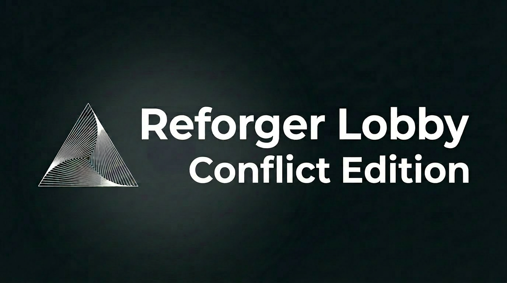
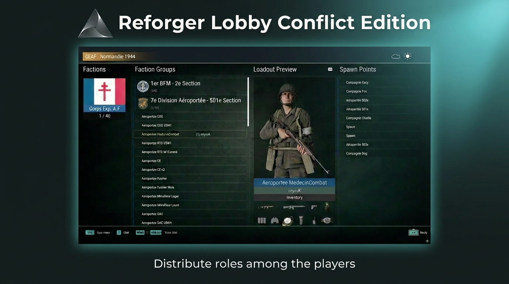

<div align="center">



# Reforger Lobby Conflict Edition

**A persistent 24/7 PvE deployment lobby for Arma Reforger — old-school squad selection, powered by Conflict.**

[](https://reforger.armaplatform.com/)
[](https://reforger.armaplatform.com/workshop)
[](https://community.bistudio.com/wiki/Arma_Reforger:Scripting)
[](#-license)

</div>

---

## 📖 About

**Reforger Lobby Conflict Edition (RLCE)** brings back the classic Arma deployment
lobby — pick a **faction**, a **group**, a **role**, a **loadout** and a **spawn
point**, then press **Play** to deploy — and rebuilds it as a **persistent PvE
server** that never ends.

It is a rework of [**ReforgerLobby / PlayableSelector**](https://reforger.armaplatform.com/workshop)
by *JiraF4*. The original ran a classic match lifecycle (briefing → game →
debriefing → server stops). RLCE **removes the lifecycle entirely** and feeds the
lobby from the live **Conflict / Campaign** systems instead of hand-placed editor
entities.

> The server stays in the `GAME` state forever. Pressing **Play** deploys only the
> *requesting* player. Dying sends that player back to the lobby to redeploy.
> Nothing a player or admin does can end the session.

| | Old PlayableSelector | Reforger Lobby Conflict Edition |
|---|---|---|
| Faction list | from placed characters | `SCR_CampaignFactionManager` |
| Group / squad | `SCR_AIGroup` placed in editor | `SCR_GroupPreset` / `SCR_GroupsManagerComponent` |
| Role / slot | placed `PS_PlayableComponent` | `SCR_GroupRolePresetConfig` |
| Loadout | none (fixed prefab) | `SCR_LoadoutManager` (+ live preview) |
| Spawn point | transform of placed char | `SCR_PlayerSpawnPoint` (faction deploy points) |
| Lifecycle | briefing → game → debriefing → **stop** | **persistent 24/7, no lifecycle** |

---

## ✨ Features

- 🟢 **Persistent server** — runs 24/7, never auto-transitions to debriefing/postgame.
- 🎯 **Per-player deploy** — "Play" spawns the requesting player only; global state never advances.
- 🧩 **Conflict-driven lobby** — factions, groups, roles, loadouts and spawn points come from the live Campaign systems.
- 🪖 **Loadout preview** — see the role's gear before you deploy.
- 💀 **Death → lobby** — a dead player re-opens the deployment lobby and redeploys.

<div align="center">

</div>

---

## 📋 Requirements

- **Arma Reforger** (PC or dedicated server — Windows/Linux).
- **Arma Reforger Tools / Workbench** if you want to embed it into your own world.
- The mod's **mod dependencies** (declared in `addon.gproj`). Make sure they are
  mounted/subscribed alongside this mod:

  ```
  Dependencies {
   "58D0FB3206B6F859" "1337133713371337" "5AAAC70D754245DD"
  }
  ```

---

## 🚀 Installation — add the lobby to your map

Wire the game mode into **your own world** (Workbench).

> ⚠️ **Use the Conflict game mode `Lobby_GameMode_Conflict.et`** (class
> `RLCE_GameModeConflict`). RLCE runs on the full vanilla Conflict
> (`SCR_GameModeCampaign`), and `Lobby_GameMode_Conflict.et` already nests every
> Conflict manager the lobby needs.

1. **Add this mod as a dependency** of your addon in the Workbench Project settings.
2. **Place the game mode.** Drop the prefab
   **`Prefabs/MP/Modes/Conflict/Lobby_GameMode_Conflict.et`** (entity class
   `RLCE_GameModeConflict`) as the game-mode entity of your world. Place exactly one
   per world. If you need to customise it, inherit your own prefab from it instead of
   editing the original.
3. **Add the Conflict faction manager as a CHILD of the game-mode entity.** Parent a
   `SCR_CampaignFactionManager` (e.g. `Prefabs/MP/Campaign/CampaignFactionManager.et`)
   **under** the `Lobby_GameMode_Conflict` entity — not as a separate world entity.
   Parenting it guarantees the game mode initialises first; a faction manager placed
   at the world root crashes on load with
   `NULL pointer ... Variable 'm_OnPlayerDisconnected'` because it tries to subscribe
   to the game mode before the game mode exists. Do the same for the other Conflict
   managers you place (loadout manager, bases system).
4. **Place deploy/spawn points and configure factions/groups/loadouts** (see
   Configuration below).
5. Compile in **Workbench** (no script errors), load a local dedicated session, and
   verify the lobby opens and deploy works.

> ⚠️ There is **no automated test runner**. Validate by compiling in Workbench and
> checking behavior in a live/dedicated session.

---

## ⚙️ Configuration — components to set up

The lobby is driven by components on the **game-mode entity**
(`Lobby_GameMode_Conflict.et` — class `RLCE_GameModeConflict`) and by **Conflict**
managers/points parented under it or placed in the world.

| What | Component / asset | Where | Why |
|------|-------------------|-------|-----|
| Game mode | `RLCE_GameModeConflict` (prefab `Prefabs/MP/Modes/Conflict/Lobby_GameMode_Conflict.et`) | World root entity | Hosts the lobby on full Conflict, freezes lifecycle in `GAME`. |
| Mission data | `PS_MissionDataManager` | On the game-mode entity | Drives lobby data export. |
| Factions | `SCR_CampaignFactionManager` | **Child of the game-mode entity** | Source of the faction list. Must be parented under the game mode. |
| Groups / roles | `SCR_GroupsManagerComponent` + `SCR_GroupPreset` / `SCR_GroupRolePresetConfig` | Faction config | Source of squads and roles. |
| Loadouts | `SCR_LoadoutManager` | Faction / arsenal config | Source of selectable loadouts + preview. |
| Spawn points | `SCR_PlayerSpawnPoint` / `SCR_SpawnPoint` | Placed per faction in the world | Where deploy puts the player. |
| Respawn | `SCR_RespawnSystemComponent` (modded) | On the game-mode entity | Routes death back to the lobby. |

**Checklist for a working map:**

- [ ] `Lobby_GameMode_Conflict.et` (`RLCE_GameModeConflict`) placed as the world's game mode.
- [ ] `SCR_CampaignFactionManager` parented **under** the game-mode entity.
- [ ] At least one **faction** configured via the Campaign faction manager.
- [ ] At least one **group preset** with **roles** per faction.
- [ ] At least one **loadout** per role/faction.
- [ ] At least one **spawn point** per faction, placed on the map.

---

## 🧱 Project layout & naming conventions

| Prefix | Meaning |
|--------|---------|
| `RLCE_*` | **Reforger Lobby Conflict Edition** — new files authored by this rework. Preferred prefix for new contributions. |
| `PS_*` | Inherited PlayableSelector core. Kept as-is — these class names are referenced across the codebase, prefabs and layouts, so renaming a `PS_` class cascades everywhere. |
| `PS_M_SCR_*` / `RLCE_M_SCR_*` | `modded class` patches of a base-game class. The class keeps the vanilla name; only the file carries the prefix. |
| `O_*` | Read-only **original vanilla** reference under `reference/Game/` — never edited, not compiled. |

See [`CLAUDE.md`](CLAUDE.md) and [`PROJECT.md`](PROJECT.md) for the full design intent
and the hard rules (server never ends, play = deploy one player, death → lobby).

---

## 🤝 Contributing

Contributions are welcome — this is an open-source project.

1. **Read [`PROJECT.md`](PROJECT.md) first.** It defines the persistent-server model
   and the hard constraints. PRs that re-introduce a mission lifecycle (debriefing,
   auto-end on objectives, server shutdown) will not be accepted.
2. Prefix new files with **`RLCE_`**. Don't rename inherited `PS_` *classes*.
3. There is no unit-test runner: verify with a **Workbench compile + in-game check**
   and describe what you tested in the PR.
4. Write issues/PRs in whatever language is comfortable — maintainers reply in kind.

---

## 🙏 Credits

- **ReforgerLobby / PlayableSelector** by *JiraF4* — the original lobby this project forks.
- **Bohemia Interactive** — Arma Reforger & the Enfusion engine.
- Everyone contributing to **Reforger Lobby Conflict Edition**.

---

## 📜 License

See the [`LICENSE`](LICENSE) file. Inherited PlayableSelector code remains under its
original license; please respect the upstream terms.
