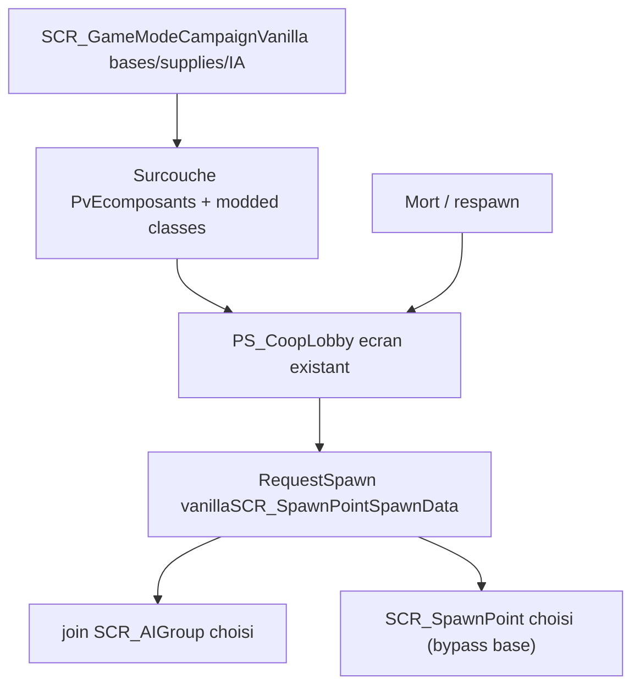

<!-- cb2469af-3fd4-4027-b9cf-0ec634be75af -->
---
todos:
  - id: "phase0-prep"
    content: "Phase 0: brancher git, figer le plan dans docs/superpowers/plans/, confirmer en Workbench le prefab Conflict vanilla (GameMode_Conflict.et) et un monde Conflict de référence"
    status: pending
  - id: "phase1-world-prefab"
    content: "Phase 1 (Workbench): monde Conflict (bases/HQ/supply/SCR_SpawnPoint) + nouveau prefab game mode héritant de Conflict vanilla avec nos composants overlay; mission .conf -> nouveau monde"
    status: pending
  - id: "phase2-overlay-class"
    content: "Phase 2: classe PVE_GameModeConflict : SCR_GameModeCampaign (ouverture lobby, GenerateDeploymentGroups, ReturnPlayerToLobby) + neutralisation fin/victoire Conflict"
    status: pending
  - id: "phase3-deploy-vanilla"
    content: "Phase 3: remplacer la possession (RequestDeploy/SwitchToDeployedEntity) par SCR_RespawnComponent.RequestSpawn(SCR_SpawnPointSpawnData) + join SCR_AIGroup vanilla"
    status: pending
  - id: "phase4-respawn-lobby"
    content: "Phase 4: mort/respawn -> rouvrir notre lobby (interception deploy menu vanilla); conserver retour lobby mort + bouton respawn pause"
    status: pending
  - id: "phase5-bypass-base-spawn"
    content: "Phase 5: bypasser la validation de spawn par base pour spawner au SCR_SpawnPoint choisi, sans casser la capture de bases"
    status: pending
  - id: "phase6-remove-legacy"
    content: "Phase 6: migrer les références PS_GameModeCoop (lobby/controller/manager) vers PVE_GameModeConflict puis supprimer PS_GameModeCoop, possession, dualité de groupes, respawn neutralisé"
    status: pending
  - id: "phase7-cleanup-verify"
    content: "Phase 7: nettoyage prefabs/refs morts, compile Workbench 0 erreur, test in-game complet du flux"
    status: pending
isProject: false
---
# Migration vers Conflict complet + surcouche lobby

## Objectif

Retirer la base ReforgerLobby/PlayableSelector (`PS_GameModeCoop`, possession custom, double groupe) et faire reposer le mod sur le **Conflict vanilla complet** (`SCR_GameModeCampaign`), avec notre lobby (`PS_CoopLobby`) et notre choix groupe/loadout/spawn point en **surcouche**. Le déploiement utilise le **spawn vanilla** (`SCR_RespawnComponent.RequestSpawn`) et **bypasse les spawns par base** (on spawn au point choisi dans le lobby). Conflict garde son gameplay (prise de bases, supplies, IA).

## Etat de départ (vérifié)

- Mission [ArlandPVELobby.conf](PvE Lobby Edition/Missions/ArlandPVELobby.conf) -> monde `Worlds/ArlandPVELobby.ent`.
- Game mode [PS_GameMode_Lobby.et](PvE Lobby Edition/Prefabs/MP/Modes/PS_GameMode_Lobby.et) = `PS_GameModeCoop` héritant de [GameMode_Base.et](PvE Lobby Edition/Prefabs/MP/Modes/GameMode_Base.et) (`SCR_BaseGameMode`, **frère** de Conflict).
- `PS_GameModeCoop : SCR_BaseGameMode` ([PS_GameModeCoop.c](PvE Lobby Edition/scripts/Game/PS_GameModeCoop.c)) — déploiement par **possession** (`RequestDeploy` L922 spawn le loadout + exige `PS_PlayableComponent`, puis `SwitchToDeployedEntity`).
- [PS_PlayableManager.c](PvE Lobby Edition/scripts/Game/Playable/PS_PlayableManager.c) hard-cast `PS_GameModeCoop`, modèle double groupe `m_PlayersGroup`/`m_BotsGroup`.
- Respawn vanilla **neutralisé** ([PS_M_SCR_RespawnSystemComponent.c](PvE Lobby Edition/scripts/Game/GameMode/Respawn/PS_M_SCR_RespawnSystemComponent.c)).
- Déjà branché sur des données Conflict : factions (`SCR_CampaignFactionManager`), groupes générés depuis `SCR_GroupRolePresetConfig`, spawn points `SCR_SpawnPoint`, loadouts `SCR_LoadoutManager`. **Ce travail de data-binding est réutilisable.**

## Cible architecture

- **Base** : prefab game mode = Conflict vanilla (`GameMode_Conflict.et`) + nos composants overlay.
- **Classe** : nouvelle `PVE_GameModeConflict : SCR_GameModeCampaign` (ou `modded class SCR_GameModeCampaign`) hébergeant : ouverture lobby à la connexion, génération des groupes de déploiement, retour lobby. Conditions de victoire/fin neutralisées (persistant 24/7).
- **Deploy** : `SCR_RespawnComponent.RequestSpawn(SCR_SpawnPointSpawnData(loadout, spawnPoint.GetRplId()))` au lieu de la possession. Plus besoin de `PS_PlayableComponent` sur les loadouts.
- **Groupes** : join direct du `SCR_AIGroup` vanilla (fix de nom déjà OK), suppression de la dualité.
- **Spawn** : on autorise le spawn au `SCR_SpawnPoint` choisi indépendamment de la possession de base (bypass), tout en laissant la capture de bases vivre pour le gameplay.

## Découpage par phases (chaque phase compile + se teste en Workbench)

### Phase 0 — Préparation
- Brancher git (`feat/conflict-migration`), figer le plan dans `docs/superpowers/plans/`.
- Confirmer en Workbench le GUID/chemin exact du prefab Conflict vanilla (`GameMode_Conflict.et`) et d'un monde Conflict de référence.

### Phase 1 — Monde + prefab game mode sur Conflict (WORKBENCH, par l'utilisateur)
- Choisir/construire un **monde Conflict** (bases, HQ, supply, `SCR_SpawnPoint` de déploiement). Soit partir d'un monde Conflict existant, soit ajouter la couche Conflict au monde actuel.
- Nouveau prefab game mode héritant du **Conflict vanilla**, en y ré-ajoutant nos composants overlay (`PS_PlayableManager` slimmé, `PS_VoNRoomsManager`, managers objectifs/mission/cutscene voulus, `ItemPreviewManager_PS`, `InitialPlayer`).
- [ArlandPVELobby.conf](PvE Lobby Edition/Missions/ArlandPVELobby.conf) -> pointer le nouveau monde.
- *Note : étape majoritairement Workbench ; je fournis la liste précise des composants à porter et l'ordre.*

### Phase 2 — Classe overlay du game mode
- Créer `PVE_GameModeConflict : SCR_GameModeCampaign` (ou `modded class SCR_GameModeCampaign`) : ouverture du lobby à la connexion, `GenerateDeploymentGroups()` (réutilisé de [PS_GameModeCoop.c](PvE Lobby Edition/scripts/Game/PS_GameModeCoop.c)), `ReturnPlayerToLobby()`.
- Neutraliser fin/victoire Conflict (rester en jeu en permanence) via overrides ciblés.

### Phase 3 — Déploiement via spawn vanilla
- Remplacer `RequestDeploy`/`SwitchToDeployedEntity` par un build de `SCR_SpawnPointSpawnData(loadout, spawnPoint.GetRplId())` -> `SCR_RespawnComponent.RequestSpawn(data)` côté serveur pour le joueur demandeur.
- Joueur rejoint le `SCR_AIGroup` choisi (vanilla). Supprimer l'exigence `PS_PlayableComponent` et le spawn de prefab loadout custom.

### Phase 4 — Mort / respawn -> lobby
- Dé-neutraliser le respawn vanilla nécessaire ; intercepter "ready to spawn" / le deploy menu (déjà fait par [PS_M_SCR_PlayerDeployMenuHandlerComponent.c](PvE Lobby Edition/scripts/Game/Modded/PS_M_SCR_PlayerDeployMenuHandlerComponent.c)) pour rouvrir **notre** lobby.
- Conserver le retour lobby sur mort + bouton respawn menu pause (déjà implémenté).

### Phase 5 — Bypass des spawns par base
- Autoriser le spawn au `SCR_SpawnPoint` choisi indépendamment de l'appartenance de base (override de la validation de spawn Conflict ou points de déploiement dédiés), sans casser la capture de bases.

### Phase 6 — Découplage / suppression du legacy ReforgerLobby
- Migrer les références `PS_GameModeCoop` de [PS_CoopLobby.c](PvE Lobby Edition/scripts/Game/UI/Lobby/PS_CoopLobby.c), [PS_PlayableControllerComponent.c](PvE Lobby Edition/scripts/Game/Playable/PS_PlayableControllerComponent.c), [PS_PlayableManager.c](PvE Lobby Edition/scripts/Game/Playable/PS_PlayableManager.c) vers `PVE_GameModeConflict`.
- Supprimer `PS_GameModeCoop`, la possession, la dualité de groupes, le système de playables placés, les overrides de respawn neutralisés.

### Phase 7 — Nettoyage + validation
- Retirer prefabs/refs morts. Compile Workbench 0 erreur. Test in-game complet : connexion -> lobby -> faction/groupe/loadout/spawn -> Play (spawn vanilla au point choisi, bon groupe nommé) -> capture de base fonctionne -> mort -> retour lobby -> redeploy.

## Risques / points d'attention
- **Workbench obligatoire** pour le monde Conflict et le prefab game mode (Phase 1) — je ne peux pas éditer la géométrie du monde, je guide.
- `SCR_GameModeCampaign` apporte ses propres conditions de fin/économie -> bien les neutraliser pour le 24/7.
- Décou­plage `PS_GameModeCoop` large : à faire en dernier (Phase 6) pour garder un build qui compile à chaque étape.
- Loadouts : passer de "prefab playable" à "loadout resource" vanilla — vérifier que les loadouts du lobby sont bien des `SCR_BasePlayerLoadout`/loadout resources.

## Validation
Pas de tests auto : chaque phase = **compile Workbench (0 erreur)** + observation in-game sur session locale/dédiée.